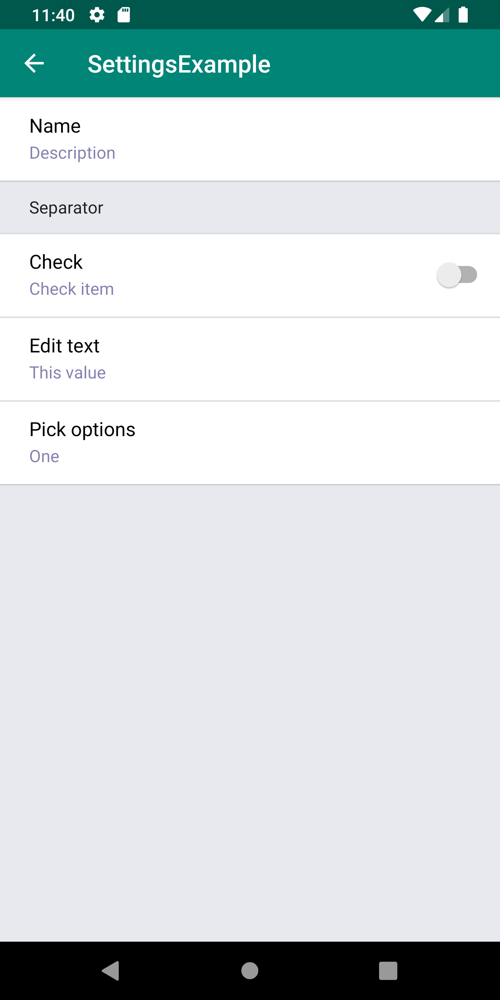
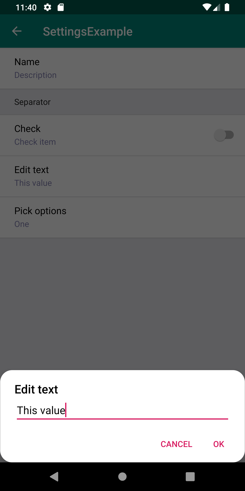
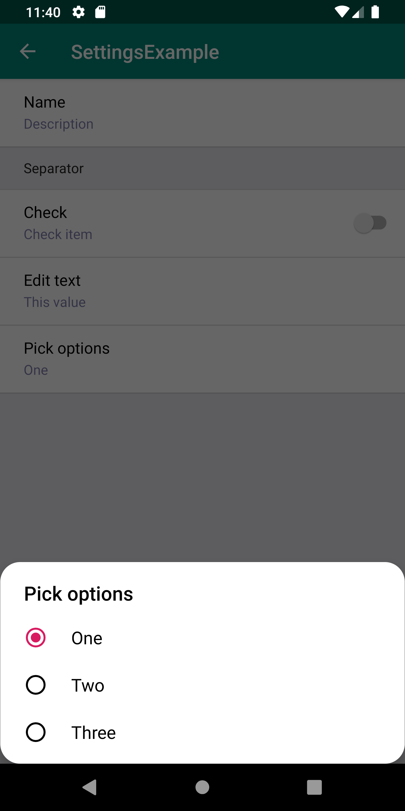
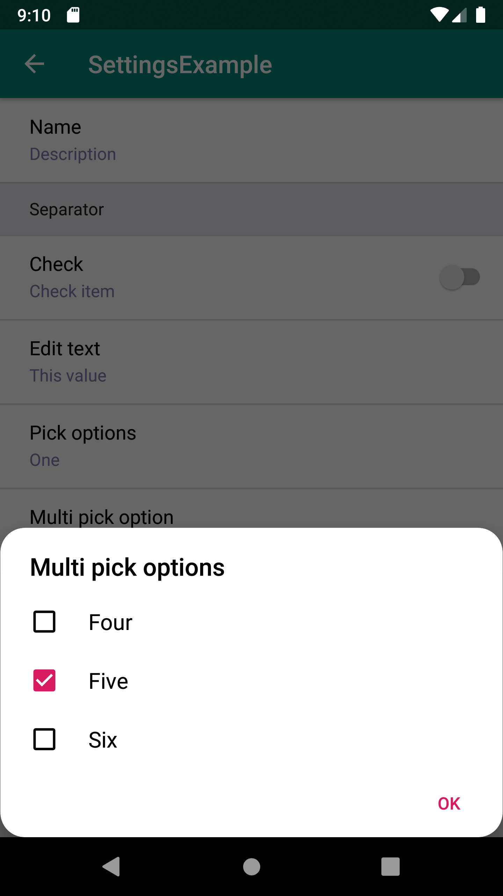

# Settings
Pretty basic settings implementation with POJO Activity.

NOTE! If you need something more powerful, please look at the https://github.com/or-dvir/EasySettings



## Gradle dependency

Add it in your root build.gradle at the end of repositories:

```
allprojects {
		repositories {
			...
			maven { url 'https://jitpack.io' }
		}
	}
```

Add the dependency:

`implementation 'com.github.rumataestorish:settings:1.0.0.8'`
				
## Supported settings options:
`SettingsItem(name: String, description: String?)` - plain text with name and description

`SettingsCheckItem(name: String, description: String?, isChecked: Boolean)` - check item with name and description

`SettingsSeparator(name: String)` - separator between settings


## How to
### First: extend SettingsBaseFragment
Add some settings, you should override getSettings():

```
/*TEXT_ITEM, SEPARATOR etc are custom settings keys which you can use when handling settings click*/
override fun getSettings(): Map<String, ISettingsItem> =
        mapOf(
            TEXT_ITEM to SettingsItem("Name", "Description"),
            SEPARATOR to SettingsSeparator("Separator"),
            CHECK_ITEM to SettingsCheckItem("Check", "Check item", false),
            EDIT_TEXT to SettingsItem("Edit text", editItem),
            PICK_OPTION to SettingsItem("Pick options", pickOptionsArray[activeOption])
        )
```

Handle settings change:
```    
/*Receive key you've provided in getSettings() and item just in case*/
override fun onItemClick(key: String, item: ISettingsItem) {
        when (key) {
            TEXT_ITEM -> Toast.makeText(context, item.name, Toast.LENGTH_SHORT).show()
            EDIT_TEXT -> super.showEditText(context!!, item.name, editItem, false) { s -> editItem = s }
            PICK_OPTION -> super.showPickOptions(context!!, "Pick options", arrayOf("One", "Two", "Three"), activeOption, false) { i ->
                activeOption = i
            }
        }
}

/*Receive key you've provided in getSettings() for SettingsCheckItem and checked state*/
override fun onItemCheckedChange(key: String, item: SettingsCheckItem, isChecked: Boolean) {
        when (key) {
            CHECK_ITEM -> Toast.makeText(
                context,
                item.name + " checked: " + isChecked.toString(),
                Toast.LENGTH_SHORT
            ).show()
        }
}
```
Input:

To show input alert dialog on item click, you can do the following:

`super.showEditText(context: Context, title: String, hint: String, darkTheme: Boolean, ok: (String) -> Unit)`

where:

context: fragment context

title: title of alert dialog

hint: hint in input field

darkTheme: if use dark theme. Currently not supported, default value is false

ok: lambda function called when user click OK in dialog and returning String as argument

To show pick options on item click, you can do the following:

`super.showPickOptions(context: Context, title: String, values: Array<String>, checkedPosition: Int, darkTheme: Boolean, ok: (Int) -> Unit)`

where:

context: fragment context

title: title of alert dialog

values: list of string values

checkedPosition: checked position in values list

darkTheme: if use dark theme. Currently not supported, default value is false

ok: lambda function called when user click OK in dialog and returning new position as argument

To show pick multiple options on item click, you can do the following:

`super.showMultiPickOptions(context: Context, title: String, values: Array<String>, checkedPositions: BooleanArray, darkTheme: Boolean, ok: (BooleanArray) -> Unit)`

where:

context: fragment context

title: title of alert dialog

values: list of string values

checkedPositions: checked positions in values list

darkTheme: if use dark theme. Currently not supported, default value is false

ok: lambda function called when user click OK in dialog and returning new positions as argument

### Second: extend SettingsBaseActivity<T: SettingsBaseFragment>
Only one thing you should do, provide settings fragment:

```override fun getFragment(): SettingsFragment =
        SettingsFragment()
```

### Handle activity close

if you launch settings like

`startActivityForResult(Intent(this, SettingsActivity::class.java), SETTINGS_ACTIVITY_REQUEST_CODE)`

then you catch it like

```  override fun onActivityResult(requestCode: Int, resultCode: Int, data: Intent?) {
        super.onActivityResult(requestCode, resultCode, data)
        when (requestCode) {
            SETTINGS_ACTIVITY_REQUEST_CODE -> {
                when (resultCode) {
                    Activity.RESULT_OK -> {
                        Toast.makeText(this, "Settings closed", Toast.LENGTH_SHORT).show()
                    }
                }
            }
        }
    }
```
    
 Otherwise you can handle broadcast like:
 
 ```
  private val settingsCloseReceiver: BroadcastReceiver = object : BroadcastReceiver() {
        override fun onReceive(context: Context, intent: Intent) {
            when (intent.action) {
                SettingsBaseActivity.SETTINGS_ACTIVITY_FINISHED -> Toast.makeText(
                    context,
                    "Settings closed intent",
                    Toast.LENGTH_SHORT
                ).show()
            }
        }
    }
    
    override fun onCreate(savedInstanceState: Bundle?) {
        super.onCreate(savedInstanceState)
        setContentView(R.layout.activity_main)
        registerReceiver(
            settingsCloseReceiver,
            IntentFilter(SettingsBaseActivity.SETTINGS_ACTIVITY_FINISHED)
        )
    }


    override fun onDestroy() {
        super.onDestroy()
        unregisterReceiver(settingsCloseReceiver)
    }
 ```
 

